**Repository ini dibuat untuk memenuhi tugas bahasa pemrograman pertemuan ke-4**

==================================================
**Nama      : Ahmad Muafiq**

**NIM       : 312010152**

**Kelas     : TI.20.B1**

==================================================

##       LANGKAH-LANGKAH INSTALASI DAN MENGGUNAKAN GIT

1. **Buka website github [click here](https://git-scm.com/), kemudian download softwarenya.**

2. **Setelah file terunduh, silahkan install software tersebut. [click here](https://www.niagahoster.co.id/blog/git-tutorial-dasar/) untuk melihat tutorialnya.**

3. Setelah instalasi selesai, buka *Software* **Gitbash** pada menu windows atau Dekstop

4. **kemudian untuk melakukan pengecekan versi ketik *git --version***

Jika muncul tampilan git version, berarti Git sudah berhasil di install dan bisa digunakan. 

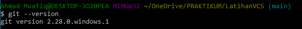

**Langkah pertama kita harus mengkonfigurasi user nama dan email di Git, dengan mengetikkan syntax berikut :**

*$ git config --global user.name "Masukkan Nama Anda disini" $ git config --global user.email "Masukkan Email Anda disini"*

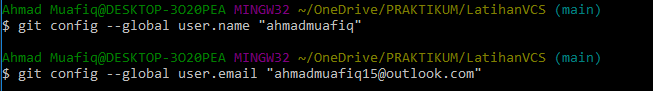

**Setelah diisi, silahkan lakukan pengecekan user nama dan email, dengan mengetikkan perintah berikut :**

*$ git config --global user.name* 
*$ git config --global user.email*

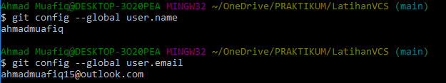

5. **Setelah melakukan proses instalasi, langkah selanjutnya yaitu membuat akun baru pada GitHub.**

6. **kemudian buka browser dan buka website Github nya [disini](https://github.com/), klik tanda + kemudian pilih New Repository.** 

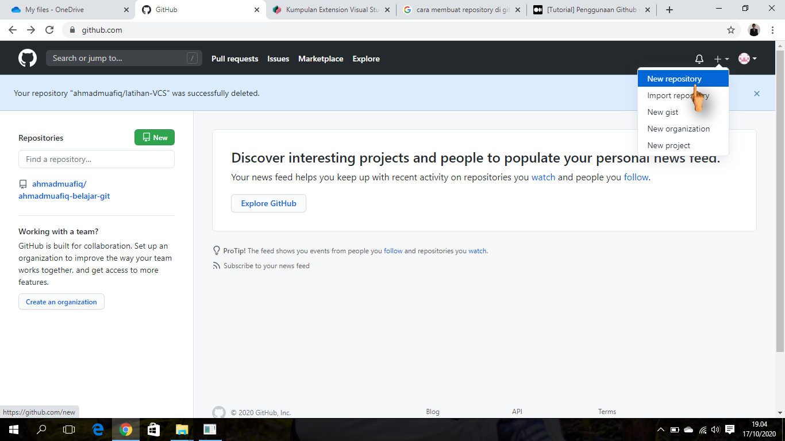

7. **Kemudian Anda akan diarahkan pada halaman untuk membuat repository baru seperti gambar di bawah ini.**

**Anda perlu mengisi detail informasi berikut:**

**Nama Repository : digunakan untuk identitas repository yang dibuat.**
**Deskripsi Repository : berfungsi untuk deskripsi dari repository yang dibuat.**
**Jenis Repository   : jenis repository  dibagi menjadi Public dan Private. Ketika Anda mengatur repository menjadi Public, orang lain dapat melihat repository yang Anda buat. Sebaliknya, jika Anda mengaturnya sebagai Private, repository tersebut hanya bisa diakses oleh Anda.**
**Setelah mengisi detail informasi di atas, klik Create Repository.**

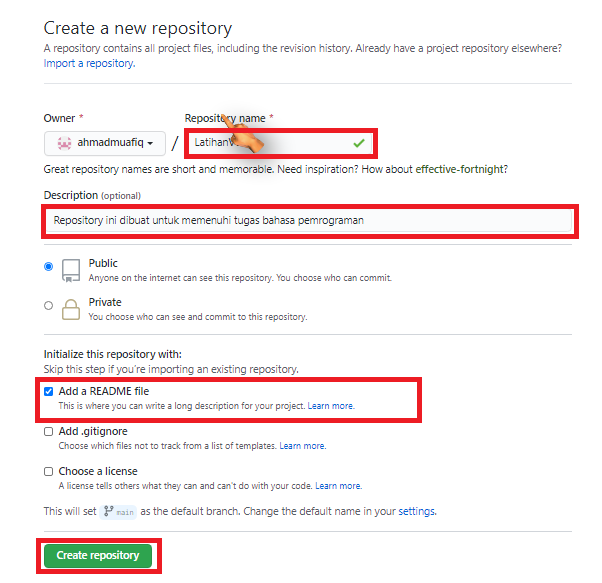

8. **Langkah selanjutnya yaitu buka *file explorer* kemudian klik kanan dan pilih *Git Bash Here* seperti pada gambar dibawah**

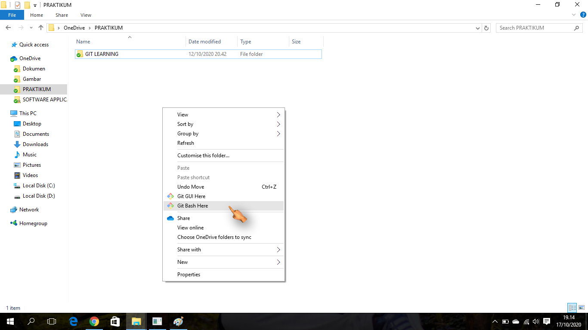

9. **Setelah melakukan GitBush here* anda akan otomatis diarahkan ke CMD, langkah selanjutnya ketik :**

$ git clone (copy-paste link dari web github)

seperti gambar dibawah ini

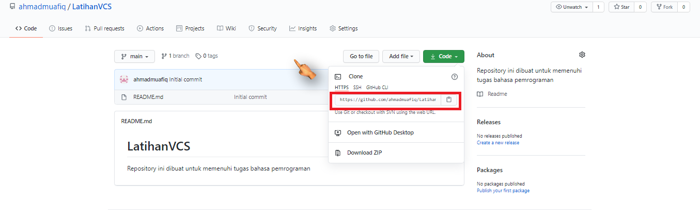

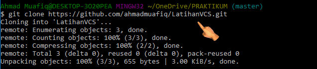

10. **Ubah Folder Menjadi Repository.**

Setelah itu, ubah folder tersebut menjadi repository menggunakan perintah berikut:

$ git init

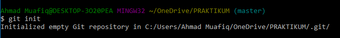

11. **Tambahkan File ke Repository**

Untuk bisa menambahkan file ke repository GitHub, Anda perlu menerapkan langkah-langkah di bawah ini:

Buat file di folder yang sudah dibuat (PRAKTIKUM). 

Contohnya, di sini kami membuat file README.md

Kemudian edit file tersebut dan simpan.

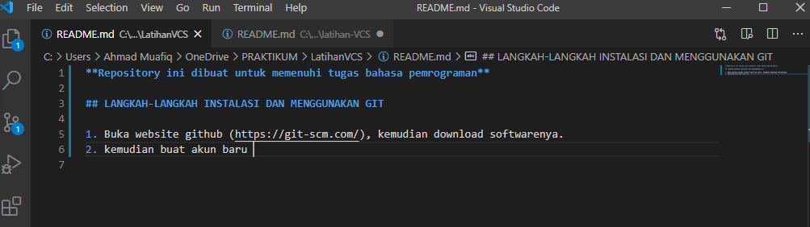

Buka GitBash lalu masukkan perintah berikut:

$ git add .

**Perintah tersebut tidak akan menghasilkan output apa pun.**

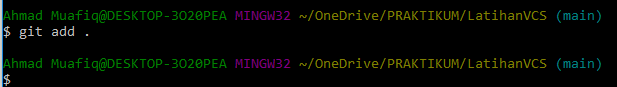

12. Membuat Commit 

Selanjutnya, Anda perlu membuat Commit. 

Commit berfungsi untuk menambahkan update file serta komentar. Jadi setiap kontributor bisa memberikan konfirmasi update file di proyek yang sedang dikerjakan. Masukkan perintah berikut untuk membuat Commit:

$ git commit -m "update README.md"

Pada tutorial ini kami membuat update README.md sebagai Commit pertama kami. Anda bebas membuat membuat nama Commit apa saja.

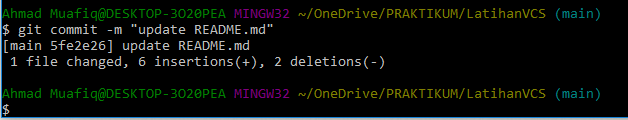

13. **Push ke GitHub**

Langkah terakhir adalah push ke GitHub Push ini berfungsi untuk mengupload hasil akhir dari langkah-langkah di atas. Masukkan perintah berikut untuk melakukan push ke GitHub:

$ git push 

Perintah di atas akan menampilkan pop up sign in GitHub. Anda perlu login untuk melanjutkan proses push ke GitHub. 

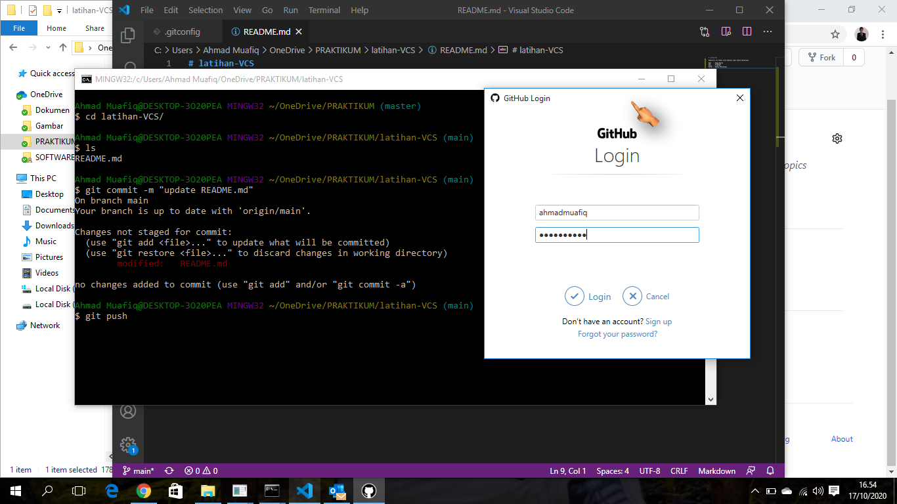

**Jika proses login berhasil, akan muncul tampilan Command Prompt seperti di bawah:**

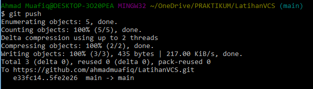

14. **Cek File** 

Setelah itu, cek repository yang telah Anda buat. Anda akan mendapati file-file yang telah ditambahkan sebelumnya. Pada tutorial ini kami menambahkan beberapa file, yaitu picture dan README.md

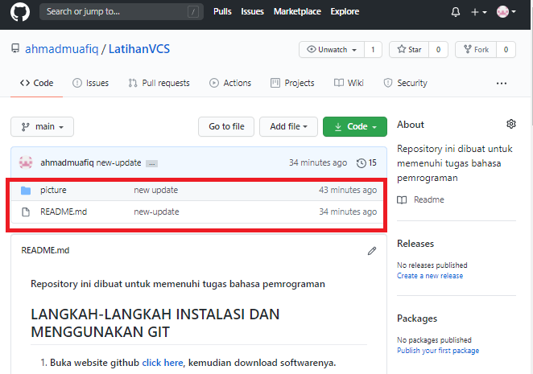

## Kesimpulan

**Cara menggunakan Git ini wajib diketahui dan dikuasai oleh semua developer karena akan sangat membantu dalam mengerjakan project pembuatan website. Demikian penjelasan tentang cara menggunakan Git.**

