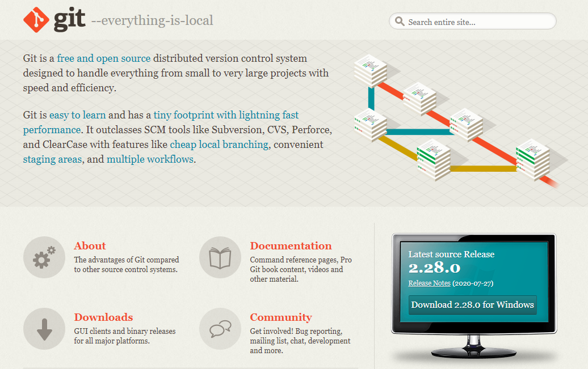

**Repository ini dibuat untuk memenuhi tugas bahasa pemrograman**

## LANGKAH-LANGKAH INSTALASI DAN MENGGUNAKAN GIT

1. **Buka website github [click here](https://git-scm.com/), kemudian download softwarenya.**

2. **Setelah file terunduh, silahkan install software tersebut. [click here](https://www.niagahoster.co.id/blog/git-tutorial-dasar/) untuk melihat tutorialnya.**

3. Setelah instalasi selesai, buka *Software* **Gitbash** pada menu windows atau Dekstop

4. **kemudian untuk melakukan pengecekan versi ketik *git --version*, Enter**

5. **kemudian buka browser dan buka website Github nya [disini](https://github.com/)**, klik tanda + kemudian pilih New Repository. 

